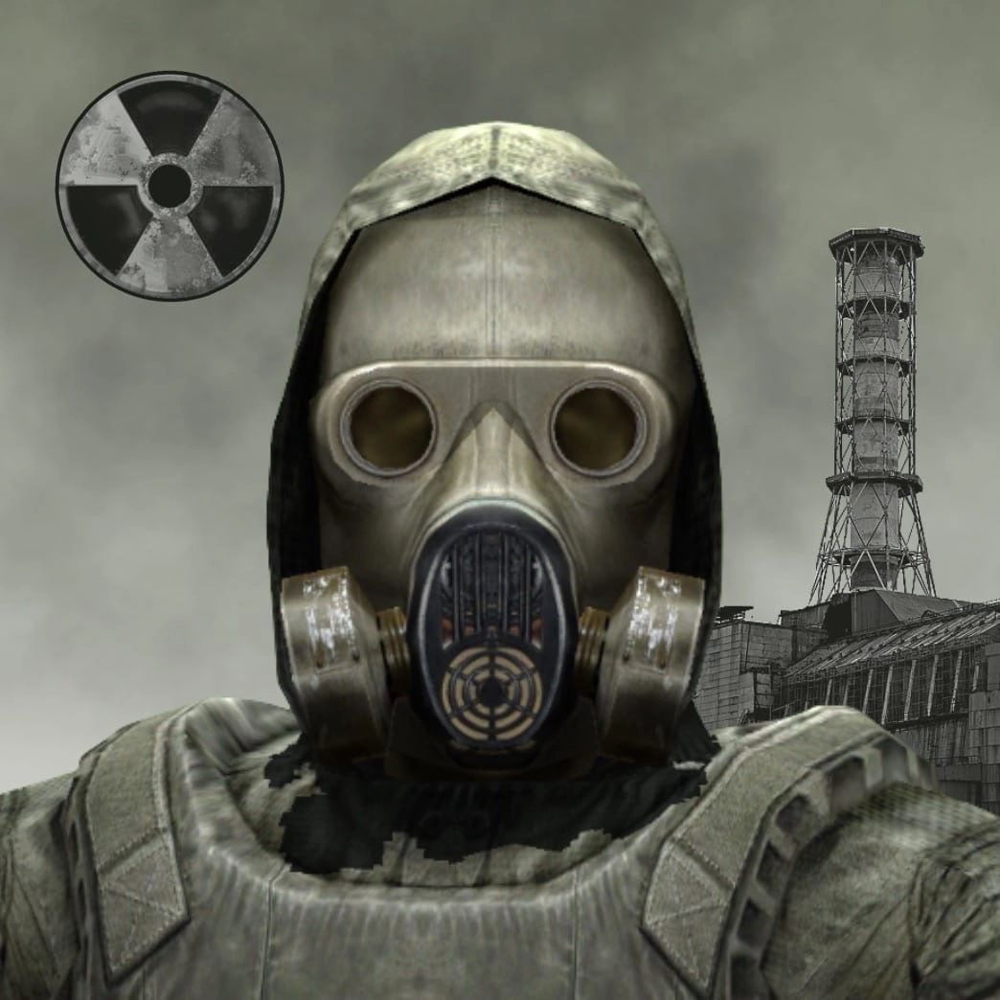
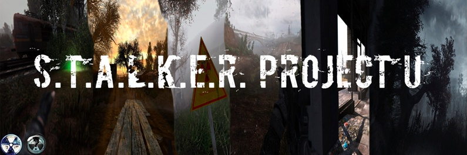

import Bleed from 'nextra-theme-docs/bleed'

# Основные проекты

## 1. [Путь Зоны](https://t.me/GartGame) (SoC; ТЧ):
<Bleed></Bleed>
**О проекте:** появился сравнительно недавно, но обрёл большую популярность. 

**Особенности:** есть все локации из оригинальной игры, реализованы диалоги (Что интересного расскажешь? И т.д.), возможность обыскивать тайники. Что нереализованно: сюжетка, стрельба (будет в следующем билде - 1.0.8), ИИ (базовый, ну типа ходьба, возможно война с мутантами в 1.0.9) 

**Последний билд:** 1.0.7 от 18 ноября 2021, добавлена оптимизация

**Разработчик:** GartGame [(Артур Живкович)](https://vk.com/arturjiv)

**Статус:** развивается

**Скачать билд:** [[Пост в телеграме]](https://t.me/GartGame/104); [[Телеграм Чат]](https://t.me/GartGameChat); [[Группа в ВК]](https://vk.com/gartgame)

## 2. [S.T.A.L.K.E.R. Clear Sky [U]](https://vk.com/stalkerumobile) (CS; ЧН)
<Bleed></Bleed>

**О проекте:** появился пол года назад. Выпущено 2 билда.

**Особенности:** есть локация Болота и тестовый уровень, доступно оружие. Недоступно: ИИ, остальные локации.

**Последний билд:** версия 1.6.0 билд 1002 от 22 ноября 2021. Изменения: Оптимизация, основа инвентаря

**Разработчик:** [Игорь Кирилюк](https://vk.com/duppeh)

**Статус:** активно развивается

**Скачать билд:** [[Пост в ВК]](https://vk.com/wall-182231606_2346)

## 3. [S.T.A.L.K.E.R. Call of Pripyat Mobile](https://vk.com/stalker.cop.mobile) (CoP; ЗП):
<Bleed></Bleed>

**О проекте:** единственный проект по Зову Припяти. 

**Особенности:** локация "Окрестности Юпитера". Базовый ИИ у мутантов, на карте присутствуют квестовые NPC, стоящие в Т-позе. Автор планирует написать парсер для переноса объектов из оригинала в Unity.

**Последний билд:** 0.1 от 12 марта 2021

**Разработчик:** [Максим Донцов](https://vk.com/md0508)

**Статус:** развивается

Скачать: [[Пост в ВК]](https://vk.com/wall-181941504_9014)

## 4. Проекты от [Никиты R](https://vk.com/nikita_r_public):
<Bleed></Bleed>

***4.1: S.T.A.L.K.E.R. Oblivion Lost (ХЗ)***

**О проекте:** проект по портированию ранней версии сталкера, со всеми его особенностями.

**Особенности:** 3 билда, одна локация - Кордон. Есть здоровье, выносливость, ПДА.

**Последний билд:** 0.0.4

**Разработчик:** Никита R

**Статус:** не развивается

**Скачать:** [[Пост в ВК]](https://vk.com/wall-200764374_192)

***4.2: S.T.A.L.K.E.R. Mobile Remake:***

**О проекте:** ремейк java игры 2007 года. 

**Особенности:** вертикальная ориентация, пушки, линейный сюжет, довольно тяжелая игра, не пойдет на слабых аппаратов.

**Последний билд:** S.T.A.L.K.E.R. Mobile Remake Demo 1.1

**Разработчик:** Никита R

**Скачать билд:** [[Пост в ВК]](https://vk.com/wall-200764374_645)

***4.3: [S.T.A.L.K.E.R. Shadow of Chernobyl Mobile:](https://vk.com/nikita_r_public?w=wall-200764374_739)***

**О проекте:** очень хорошо проработан, даже вертолет из начала игры

**Особенности:** прекрасная графика, пушки, без сюжета, есть диалоги, очень тяжелая игра, не пойдет на слабых аппаратов, да и на средних.

**Последний билд:** S.T.A.L.K.E.R.: SoC Mobile 1.4.5 от 15 сентября 2021

**Разработчик:** Никита R

**Скачать билд:** [[Пост в ВК]](https://vk.com/nikita_r_public?w=wall-200764374_739); [[Google Drive]](https://drive.google.com/drive/u/0/folders/1dPtpMhTHfbtHsvxAoPEoYahxIBvglDH_)

## 5. [Project Stalker](https://vk.com/projectstalker) (SoC; ТЧ):
<Bleed></Bleed>

**О проекте:** один из самых первых проектов, заброшен из-за проблем с GSC. 

**Оссобенности:** присутствует локация кордон, неплохой ИИ, пасхалки, оружие и много чего ещё. Из минусов одна локация и нет сохранений

**Последняя версия:** 2.0 от 30 июня 2019 года.

**Разработчики:** [Алексей Калачёв](https://vk.com/id4886208); [Дмитрий Злойпрограммер](https://vk.com/id160185949); [Антон Гурский](https://vk.com/id2765000); [Belfegnar Bydlocoding](https://vk.com/belfegnar)

**Статус:** заброшен

**Скачать билд:** [[Перезалив на Яндекс.Диск]](https://disk.yandex.ru/d/zWoU2RTyrdOKxA); [[Перезалив на Google Drive]](https://drive.google.com/file/d/1QcjrWeJ6opUSSph8_MgjYd1GElIRezJX/view?usp=drivesdk)

## 6. [STALKER ANDROID](https://vk.com/stalker.android) (SoC; ТЧ):
<Bleed></Bleed>

**О проекте:** духовный наследник Project Stalker, уж очень он похож на него.

**Оссобенности:** также одна локация - Кордон, неплохой ИИ, есть PDA, и главная оссобенность есть сохранения. 

**Последний билд:** 0.0.5 (Тест ИИ) от 2 февраля 2021. Локация - Арена

**Разработчик:** NGame [(Руслан Кукуев)](https://vk.com/id344346055)

**Статус:** заброшен

**Скачать:** [[Билд с Кордоном]](https://vk.com/wall-174809909_12652); [[Билд с Ареной]](https://vk.com/wall-174809909_14326)

## 7. [S.T.A.L.K.E.R. Mobile Edition](https://vk.com/mobile.stalker) (SoC; ТЧ):
<Bleed></Bleed>

**О проекте:** ситуация с проектом не известна, автор написал что на 35.000 подписчиков выложит билд, пока что 31-32 тысячи. Фейк это или нет, мы узнаем нескоро

**Оссобенности:** был выложен Бенчмарк. В предпологаемом билде есть практически все локации, оружие, сохранения, ПДА и многое другое...

**Последняя версия:** Benchmark_3 от 17 июля 2020

**Разработчик:** [Альберт Эйнштейн](https://vk.com/id554676622); [Антон Токарев](https://vk.com/psnhacker)

**Статус:** вроде живой

**Скачать:** [[Пост в ВК]](https://vk.com/wall-184902497_39772)
